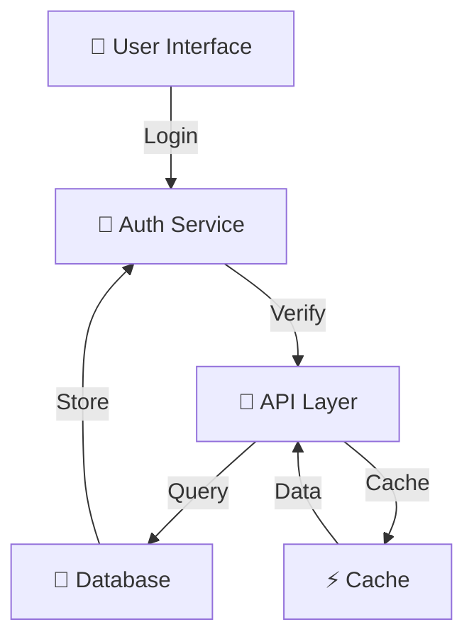

# Code Analyzer - Complete Features Overview

## 🎯 Core Features

### 1. Multi-Language Support

Analyze code written in:
- **Python** (.py) - Full AST-based parsing
- **TypeScript** (.ts, .tsx) - Pattern-based analysis
- **Java** (.java) - Comprehensive structure extraction
- **C++** (.cpp, .cc, .h, .hpp) - Header and source analysis

Each language parser is optimized for its specific syntax and conventions.

### 2. Function & Method Extraction

#### Extracted Information

For every function in your code, the analyzer extracts:

```
✓ Function name and signature
✓ Parameter names and types
✓ Return type and value
✓ Decorators/attributes (@override, @async, etc.)
✓ Access level (public/private/protected)
✓ Whether it's static or async
✓ Line numbers and location
```

#### Example Output

```markdown
## find_user(user_id: str) -> Optional[User]

**Parameters:**
- `user_id` (str): Unique identifier for the user

**Returns:** Optional[User] - User object if found, None otherwise

**Decorators:** @cache

**Example:**
```python
user = manager.find_user("user123")
if user:
    print(user.name)
```
```

### 3. Class & Type Analysis

#### For Every Class/Type

```
✓ Class name and hierarchy
✓ Parent class(es) / inheritance
✓ Implemented interfaces
✓ All methods with signatures
✓ All properties and attributes
✓ Visibility modifiers
✓ Class documentation
```

#### Example

```markdown
## User (BaseModel)

**Inherits from:** BaseModel
**Implements:** Serializable

### Properties
- id: UUID
- name: str
- email: str (unique)
- created_at: datetime

### Methods
- validate()
- to_dict()
- from_dict()
```

### 4. Comprehensive Metrics

#### Lines of Code (LOC)
- Physical LOC: All lines including comments
- Logical LOC: Executable code only
- Commented LOC: Documentation and explanations
- Blank lines: For readability analysis

#### Cyclomatic Complexity (McCabe Complexity)

Measures code branching:
- Each `if`, `elif`, `else` adds complexity
- Each `for`, `while`, `do` adds complexity
- Each `catch` exception handler adds complexity
- Boolean operators (`and`, `or`) add complexity

**Example:**
```python
# Complexity = 1 (no branches)
def simple(x):
    return x * 2

# Complexity = 3 (if, elif, else)
def conditional(x):
    if x > 0:
        return "positive"
    elif x < 0:
        return "negative"
    else:
        return "zero"
```

#### Cognitive Complexity

Advanced metric that considers:
- Nesting depth (more nested = harder to understand)
- Control flow interruptions
- Non-linear logic patterns
- Recursion

Generally more practical than cyclomatic complexity.

#### Maintainability Index (0-171)

Composite metric combining:
- Halstead metrics (code vocabulary)
- Lines of code
- Cyclomatic complexity
- Comment percentage

**Scale:**
- 85-100: Highly maintainable ✅
- 65-85: Maintainable with minor issues
- 50-65: Some concerns ⚠️
- 25-50: Hard to maintain
- 0-25: Nearly impossible ❌

#### Halstead Metrics

Based on operator/operand counts:
- **Halstead Volume**: Code complexity measure
- **Difficulty**: How hard to maintain
- **Effort**: Estimated time to change

### 5. Code Smell Detection

#### 25+ Different Code Smells

**Category: Size Issues**
- ✓ Long methods (>50 LOC)
- ✓ Large classes (>200 LOC)
- ✓ Long parameter lists (>5 params)
- ✓ Too many branches (>10)

**Category: Complexity Issues**
- ✓ Deep nesting (>4 levels)
- ✓ High cyclomatic complexity
- ✓ High cognitive complexity
- ✓ Complex boolean expressions

**Category: Duplication**
- ✓ Duplicate code detection
- ✓ Similar code patterns
- ✓ Copy-paste code

**Category: Naming Issues**
- ✓ Unclear variable names
- ✓ Inconsistent naming
- ✓ Single-letter variables (outside loops)
- ✓ Magic numbers without explanation

**Category: Design Issues**
- ✓ God objects (doing too much)
- ✓ Feature envy (using other classes)
- ✓ Data clumps (related data)
- ✓ Primitive obsession

**Category: Exception Handling**
- ✓ Catch-all exceptions (bare `except:`)
- ✓ Silent exceptions (caught but ignored)
- ✓ Too broad exceptions
- ✓ Missing exception handling

**Category: Import Issues**
- ✓ Unused imports
- ✓ Circular dependencies
- ✓ Wildcard imports
- ✓ Too many imports

#### Example Smell Detection

```markdown
## 🔴 HIGH SEVERITY

### Catch-All Exception Handler

**Location:** auth.py, Line 142

**Code:**
```python
try:
    process_login(user)
except:
    pass  # Ignore all errors
```

**Problem:** Hides bugs, catches system exits

**Suggestion:** 
```python
try:
    process_login(user)
except AuthenticationError as e:
    logger.error(f"Auth failed: {e}")
except ValueError as e:
    logger.error(f"Invalid data: {e}")
```

### Large Class

**Location:** UserManager (api.py, Line 1)

**Problem:** 42 methods - violates Single Responsibility

**Metrics:**
- Methods: 42
- LOC: 2100
- Cyclomatic Complexity: 156

**Suggestion:** Split into:
- UserAuthManager
- UserProfileManager
- UserPermissionManager
```

### 6. Refactoring Suggestions

#### 20+ Refactoring Patterns

**Structure Refactorings**
- Extract Method
- Extract Class
- Inline Method
- Remove Dead Code

**Simplification Refactorings**
- Simplify Conditionals
- Replace Temp with Query
- Replace Magic Numbers
- Consolidate Duplicate Code

**Design Refactorings**
- Extract Interface
- Move Method
- Hide Delegate
- Replace Inheritance with Composition

**OOP Refactorings**
- Pull Up Method
- Push Down Method
- Extract Superclass
- Replace Type Code

**Example Refactoring Suggestion**

```markdown
## Extract Method - process_user()

**Current Code (87 LOC):**
```python
def process_user(user_data):
    # Validate
    if not user_data:
        raise ValueError("Empty data")
    if len(user_data['name']) < 2:
        raise ValueError("Name too short")
    # ... 30 more lines of validation
    
    # Transform
    user = User(name=user_data['name'])
    user.email = user_data['email'].lower()
    # ... 20 more lines of transformation
    
    # Store
    db.save(user)
    return user
```

**Refactored Code:**
```python
def process_user(user_data):
    validated = self._validate_user_data(user_data)
    transformed = self._transform_to_user(validated)
    return self._store_user(transformed)

def _validate_user_data(self, data):
    if not data:
        raise ValueError("Empty data")
    if len(data['name']) < 2:
        raise ValueError("Name too short")
    # ... validation logic
    return data

def _transform_to_user(self, data):
    user = User(name=data['name'])
    user.email = data['email'].lower()
    # ... transformation logic
    return user

def _store_user(self, user):
    db.save(user)
    return user
```

**Benefits:**
✅ **Readability**: Each method has clear purpose
✅ **Testability**: Can test each step independently
✅ **Reusability**: Can use _validate_user_data elsewhere
✅ **Maintainability**: Easier to modify individual steps
✅ **Complexity**: Reduced cyclomatic complexity

**Metrics Improvement:**
- Complexity per method: 28 → 7
- Max method LOC: 87 → 25
- Total methods: 1 → 4 (but simpler)
```

### 7. Automatic Documentation Generation

#### API Documentation

Generated markdown with:
- ✓ Function signatures with types
- ✓ Parameter descriptions
- ✓ Return value documentation
- ✓ Usage examples
- ✓ Exceptions that can be raised
- ✓ Related functions

#### Architecture Diagrams

Mermaid-based diagrams showing:
- ✓ Component relationships
- ✓ Data flow
- ✓ Class hierarchies
- ✓ Module dependencies

**Example:**


### 8. Summary Reports

#### Overview Report

```markdown
# Code Analysis Summary

## Statistics
- Total Files: 45
- Total LOC: 12,500
- Functions: 320
- Classes: 85

## Quality Metrics
- Average Quality Score: 72.5/100
- Average Complexity: 8.2
- Average Maintainability: 72.5/100

## Issues Summary
- Critical: 3
- High: 12
- Medium: 34
- Low: 67
```

### 9. JSON Export

Raw data export for:
- ✓ Integration with CI/CD
- ✓ Trend analysis
- ✓ Custom reporting
- ✓ Tool automation

```json
{
  "files": [...],
  "total_metrics": {...},
  "statistics": {
    "quality_score": 72.5,
    "total_smells": 116,
    "avg_complexity": 8.2
  },
  "architecture": {...}
}
```

## 📊 Comparison: Before & After

### Before Analysis
```
❌ Unknown code quality
❌ Hidden problems
❌ No documentation
❌ Difficult to improve
❌ Risk of defects
```

### After Analysis
```
✅ Clear quality metrics (e.g., 72.5/100)
✅ Specific issues identified (e.g., 34 medium severity)
✅ Auto-generated API docs
✅ 20+ specific improvements suggested
✅ Reduced defect risk
```

## 🎓 Learning Outcomes

Using the analyzer, you'll learn:

1. **Code Quality Principles**
   - What makes code maintainable
   - Industry best practices
   - Anti-patterns to avoid

2. **Design Patterns**
   - When to use specific patterns
   - How to recognize need for refactoring
   - Architectural principles

3. **Metrics Understanding**
   - What metrics matter
   - How to interpret complexity
   - Quality vs. functionality trade-offs

4. **Refactoring Techniques**
   - Specific improvement strategies
   - Step-by-step guides
   - Before/after examples

## 🔧 Customization

The analyzer can be configured with:
- Custom complexity thresholds
- Organization-specific rules
- Severity level adjustments
- Report templates
- Ignored patterns

## 📈 Continuous Integration

Integrate into your CI/CD:

```yaml
- name: Code Analysis
  run: |
    python3 -m analyzer report ./src --output ./analysis
    python3 scripts/check_quality.py ./analysis/analysis.json
  
- name: Fail on Critical Issues
  run: |
    python3 -c "
    import json
    data = json.load(open('./analysis/analysis.json'))
    critical = len([s for s in data['global_smells'] 
                   if s['severity'] == 'CRITICAL'])
    if critical > 0:
      exit(1)
    "
```

## 🚀 Performance

- Analyzes typical projects (1000+ LOC) in < 5 seconds
- Minimal memory footprint
- Handles large codebases efficiently
- Parallel processing for multiple files

## Summary

The Code Analyzer provides enterprise-grade code quality analysis with:
- 25+ code smell detections
- 20+ refactoring suggestions
- Comprehensive metrics
- Auto-generated documentation
- Visual architecture diagrams
- Integration capabilities

Transform your code quality today! 🚀
