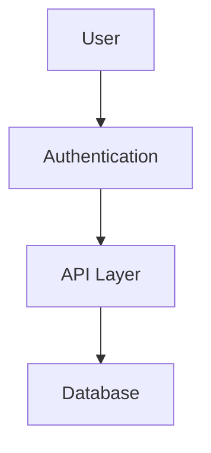

# Code Analyzer - Complete Usage Guide

## Overview

The Intelligent Code Analysis System is a comprehensive tool for analyzing, documenting, and improving your codebase. It provides deep insights into code quality, complexity, and architecture.

## Table of Contents

1. [Installation](#installation)
2. [Quick Start](#quick-start)
3. [Commands](#commands)
4. [Output Files](#output-files)
5. [Interpreting Results](#interpreting-results)
6. [Code Smells Explained](#code-smells-explained)
7. [Metrics Reference](#metrics-reference)

## Installation

```bash
# Install dependencies
pip install -r requirements.txt

# Verify installation
python3 -m analyzer --version
```

## Quick Start

### Analyze a Single File

```bash
python3 -m analyzer analyze /path/to/file.py
```

### Analyze an Entire Project

```bash
python3 -m analyzer analyze /path/to/project --recursive
```

### Generate Full Report

```bash
python3 -m analyzer report /path/to/project --output ./analysis_report
```

## Commands

### `analyze`

Analyzes code and displays a summary report in the terminal.

**Usage**:
```bash
python3 -m analyzer analyze <path> [--recursive] [--language LANG]
```

**Arguments**:
- `path`: File or directory to analyze
- `--recursive`: Search subdirectories (default: true)
- `--language`: Specify language filter (optional)

**Output**: Terminal summary with:
- Total files analyzed
- Code metrics
- Quality score
- Issue count

**Example**:
```bash
python3 -m analyzer analyze ./src --recursive
```

### `report`

Generates comprehensive analysis report with multiple markdown files and JSON data.

**Usage**:
```bash
python3 -m analyzer report <path> [--output OUTPUT_DIR]
```

**Arguments**:
- `path`: File or directory to analyze
- `--output`: Output directory for reports (default: `./analysis_report`)

**Output**: Multiple files (see [Output Files](#output-files) section)

**Example**:
```bash
python3 -m analyzer report ./src --output ./analysis_results
```

## Output Files

### 1. ANALYSIS_SUMMARY.md

High-level overview of the entire codebase.

**Contains**:
- Total files analyzed
- Supported languages breakdown
- Key metrics
- Issue summary

**Example**:
```markdown
# Code Analysis Summary

## Overview
- Total Files: 15
- Languages: Python, TypeScript, Java
- Total LOC: 5,234
- Total Functions: 342
- Total Classes: 45

## Metrics
- Quality Score: 72.5/100
- Avg Cyclomatic Complexity: 8
- Avg Maintainability Index: 65.2/100
- Lines of Comments: 1,200
```

### 2. API_DOCUMENTATION.md

Generated API documentation for all functions and classes.

**Contains**:
- Function signatures
- Parameter descriptions
- Return type information
- Examples and usage patterns

**Example**:
```markdown
## UserManager

### Methods

#### `load_users_from_file(file_path: str) -> str`

Loads user data from a file.

**Parameters**:
- `file_path` (str): Path to the user data file

**Returns**: str - Raw file contents

**Example**:
```python
manager = UserManager()
data = manager.load_users_from_file('users.json')
```

### 3. ARCHITECTURE.md

Visual representation of system architecture and components.

**Contains**:
- Component diagrams (Mermaid format)
- Module relationships
- Data flow diagrams
- Dependency overview

**Example**:


### 4. CODE_SMELLS.md

Detailed report of code quality issues and anti-patterns.

**Contains**:
- Issue categorization by severity
- Location in code
- Explanation of the problem
- Refactoring suggestions

**Example**:
```markdown
## 🟠 High Priority

### Catch-All Exception Handler
**Location**: Line 142
**Description**: Bare except clause catches all exceptions
**Suggestion**: Catch specific exceptions instead
```

### 5. REFACTORING_SUGGESTIONS.md

Actionable recommendations with before/after code examples.

**Contains**:
- Before/after code samples
- Benefits of refactoring
- Explanation of changes
- Severity levels

**Example**:
```markdown
## Extract Method

**Current Code**:
```python
def process_users(self, file_path):
    # 80 lines of mixed logic
```

**Refactored Code**:
```python
def process_users(self, file_path):
    data = self._load_data(file_path)
    return self._transform_data(data)
```
```

### 6. analysis.json

Machine-readable JSON with all analysis data.

**Contains**:
- All metrics in structured format
- Complete file-by-file analysis
- All smells and suggestions
- Statistics

**Usage**: For integration with other tools

## Interpreting Results

### Quality Score

The quality score is calculated from 0-100:

- **90-100**: Excellent - Well-maintained code
- **70-89**: Good - Minor improvements recommended
- **50-69**: Fair - Refactoring suggested
- **30-49**: Poor - Significant improvements needed
- **0-29**: Critical - Major refactoring required

### Cyclomatic Complexity

Measures code branching complexity:

- **1-5**: Simple, low risk
- **6-10**: Moderate, manageable
- **11-20**: High, refactoring recommended
- **21+**: Very high, immediate refactoring needed

### Maintainability Index

Index from 0-171 (higher is better):

- **85-100**: Highly maintainable
- **65-85**: Maintainable with minor issues
- **50-65**: Some maintainability concerns
- **25-50**: Hard to maintain
- **0-25**: Nearly impossible to maintain

## Code Smells Explained

### 1. Long Method

**Problem**: Methods/functions are too long.

**Why it's bad**: Difficult to understand, test, and maintain.

**Solution**: Extract methods, use composition.

### 2. Large Class

**Problem**: Classes have too many methods/properties.

**Why it's bad**: Violates Single Responsibility Principle.

**Solution**: Split into smaller, focused classes.

### 3. Deep Nesting

**Problem**: Excessive nested conditionals/loops.

**Why it's bad**: Hard to follow logic flow.

**Solution**: Extract methods, use guard clauses, refactor conditionals.

### 4. Duplicate Code

**Problem**: Same logic repeated in multiple places.

**Why it's bad**: Maintenance nightmare, increases bugs.

**Solution**: Extract to shared method/utility.

### 5. Magic Numbers

**Problem**: Unexplained numeric literals in code.

**Why it's bad**: Unclear meaning, hard to maintain.

**Solution**: Extract to named constants.

### 6. Catch-All Exception Handling

**Problem**: `except:` or `except Exception:` catching everything.

**Why it's bad**: Hides bugs, makes debugging difficult.

**Solution**: Catch specific exceptions.

### 7. Silent Exceptions

**Problem**: Exceptions caught but not handled.

**Why it's bad**: Errors go unnoticed.

**Solution**: Log, re-raise, or handle explicitly.

### 8. Unused Imports

**Problem**: Import statements that aren't used.

**Why it's bad**: Clutters code, causes confusion.

**Solution**: Remove unused imports.

### 9. High Cyclomatic Complexity

**Problem**: Too many conditional branches.

**Why it's bad**: Hard to test, understand, maintain.

**Solution**: Extract methods, simplify logic.

### 10. God Class

**Problem**: Class does too much.

**Why it's bad**: Violates SRP, hard to test.

**Solution**: Break into smaller classes.

## Metrics Reference

### Lines of Code (LOC)

Total lines excluding comments and blank lines.

**Good practice**: Keep individual methods under 50 LOC

### Cyclomatic Complexity

Number of independent code paths through a function.

**Formula**: Counts branches, loops, conditionals

**Ideal**: 1-5 per function

### Cognitive Complexity

Measures how hard code is to understand.

Similar to cyclomatic complexity but accounts for nesting.

**Ideal**: < 15 per function

### Maintainability Index

Composite metric combining LOC, cyclomatic complexity, and Halstead metrics.

**Scale**: 0-171 (higher is better)

### Halstead Metrics

Complexity based on operator/operand counts.

**Halstead Volume**: Lower is better

### Comment Coverage

Percentage of code that has documentation.

**Goal**: 20-30% of total lines

## Example Workflows

### Workflow 1: Code Review

```bash
# Analyze feature branch
python3 -m analyzer report ./feature --output ./review

# Check generated files
cat ./review/ANALYSIS_SUMMARY.md
cat ./review/CODE_SMELLS.md

# Share results with team
```

### Workflow 2: Technical Debt Assessment

```bash
# Analyze entire codebase
python3 -m analyzer report . --output ./debt_assessment

# Check quality metrics
python3 -c "import json; \
  data = json.load(open('./debt_assessment/analysis.json')); \
  print(f\"Quality Score: {data['statistics']['quality_score']}\")"

# Generate improvement plan based on CODE_SMELLS.md
```

### Workflow 3: Onboarding Documentation

```bash
# Analyze project for new team members
python3 -m analyzer report ./project --output ./docs/analysis

# Use API_DOCUMENTATION.md as reference
# Use ARCHITECTURE.md to understand system design
```

## Tips and Tricks

### Continuous Analysis

Add analyzer to CI/CD pipeline:

```yaml
- name: Code Analysis
  run: python3 -m analyzer report . --output ./analysis
  
- name: Check Quality
  run: |
    python3 -c "import json; \
      data = json.load(open('./analysis/analysis.json')); \
      if data['statistics']['quality_score'] < 70: exit(1)"
```

### Baseline Tracking

Track metrics over time:

```bash
# Weekly analysis
python3 -m analyzer report . --output "./analysis/week-$(date +%V)"

# Compare results
diff analysis/week-01/analysis.json analysis/week-02/analysis.json
```

### Integration with IDEs

Some IDEs can process the JSON output for inline suggestions.

## Troubleshooting

### No files analyzed

- Check file extensions are supported
- Ensure path is correct
- Try with `--recursive` flag

### Low quality score

- Review CODE_SMELLS.md
- Start with high-severity issues
- Follow refactoring suggestions

### Memory issues on large projects

- Analyze smaller subdirectories
- Use language filter
- Increase Python memory limit

## Next Steps

1. Analyze your codebase: `python3 -m analyzer report ./project`
2. Review the generated reports
3. Prioritize issues by severity
4. Follow refactoring suggestions
5. Re-analyze after improvements
6. Track metrics over time
