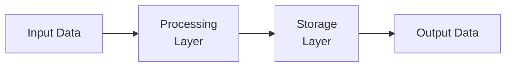

# System Architecture

## Component Overview

## Module Structure

### `sample.py`

- **Classes**: `User`, `UserManager`
- **Functions**: `duplicate_validation`, `another_validation`, `calculate_discount`, `deeply_nested_function`, `risky_operation`
- **LOC**: 94
- **Complexity**: 24

### `sample.ts`

- **Classes**: `APIService`
- **Functions**: `url`, `response`, `processData`, `validateData`, `transformData`
  ... and 37 more
- **LOC**: 136
- **Complexity**: 27

## Data Flow

