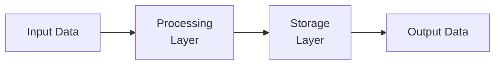

# System Architecture

## Component Overview

```mermaid
graph TB
```

## Module Structure

### `server.js`

- **Classes**: None
- **Functions**: `express`, `cors`, `mongoose`, `authRoutes`, `app`
  ... and 6 more
- **LOC**: 26
- **Complexity**: 2

### `auth.js`

- **Classes**: None
- **Functions**: `jwt`, `authenticate`, `token`, `decoded`, `require`
  ... and 53 more
- **LOC**: 15
- **Complexity**: 4

### `User.js`

- **Classes**: None
- **Functions**: `mongoose`, `bcryptjs`, `userSchema`, `salt`, `updates`
  ... and 16 more
- **LOC**: 75
- **Complexity**: 8

## Data Flow



